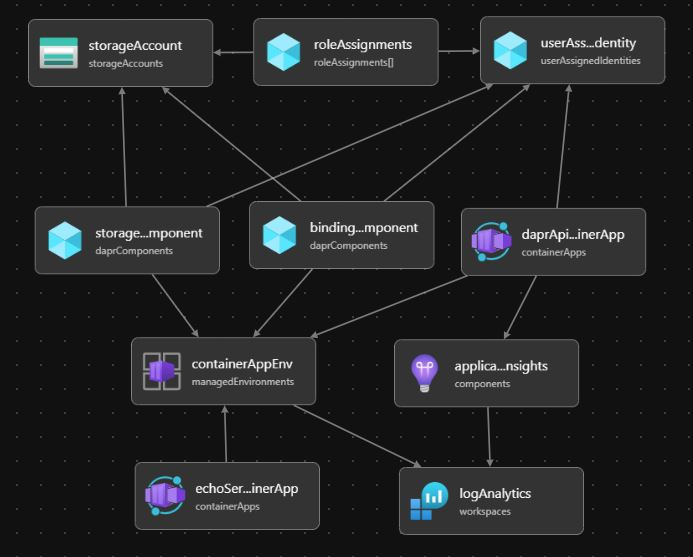

# Playing with Dapr

This repository contains several examples to test Dapr features.

- [InvokeMethodEndpoints.cs](DaprWebApi/Endpoints/InvokeMethodEndpoints.cs): invoke the EchoWebApi, a resiliency is defined in [invoke-echo-resiliency.yaml](DaprWebApi/dapr-resources/invoke-echo-resiliency.yaml)
- [StateEndpoints.cs](DaprWebApi/Endpoints/StateEndpoints.cs): for state management. Related file: [statestore.yaml](common-resources/statestore.yaml)
- [OrderPubSubEndpoints.cs](DaprWebApi/Endpoints/OrderPubSubEndpoints.cs): for publish and receive messages. Related files: [pubsub.yaml](DaprWebApi/dapr-resources/pubsub.yaml) and [subscription.yaml](DaprWebApi/dapr-resources/subscription.yaml)
- [OrderBindingEndpoints.cs](DaprWebApi/Endpoints/OrderBindingEndpoints.cs): for input and output binding using Azure Storage Queue. Related files: [binding.yaml](DaprWebApi/dapr-resources/binding.yaml) and [local-secret-store.yaml](DaprWebApi/dapr-resources/local-secret-store.yaml)

## Resources

- [Documentation](https://docs.dapr.io) 📓*Official*
  - [Building blocks](https://docs.dapr.io/developing-applications/building-blocks)
  - Reference
    - [Dapr API](https://docs.dapr.io/reference/api)
    - [Component specs](https://docs.dapr.io/reference/components-reference)
    - [Dapr CLI](https://docs.dapr.io/reference/cli)
  - [Multi-App Run](https://docs.dapr.io/developing-applications/local-development/multi-app-dapr-run) (with file: dapr.yaml)
- Examples
  - [QuickStarts examples](https://docs.dapr.io/getting-started/quickstarts) 📓 | [with code](https://github.com/dapr/quickstarts) 👤*Quickstarts*
  - [Examples](https://github.com/dapr/dotnet-sdk/tree/master/examples) 👤*SDK*
- eBook: [Dapr for .NET Developers](https://github.com/dotnet-architecture/eBooks/blob/1ed30275281b9060964fcb2a4c363fe7797fe3f3/current/dapr-for-net-developers/Dapr-for-NET-Developers.pdf) 👤*DotNET Architecture*
- [Microservices with Dapr and Azure Container Apps](https://youtu.be/-LeCQvXka9Y) 📽️*1 hour - NDC Conf 2024* | [DaprShop](https://github.com/william-liebenberg/practical-dapr) 👤*William Liebenberg*
- Other
  - [Azure Container Apps with Dapr overview](https://learn.microsoft.com/en-us/azure/container-apps/dapr-overview) 📚*MS-Learn*
  - [Dapr with .NET Aspire](https://learn.microsoft.com/en-us/dotnet/aspire/frameworks/dapr) 📚*MS-Learn*

## Prerequisites

- Install: [Dapr CLI](https://docs.dapr.io/getting-started/install-dapr-cli)
  - Option #1: [Downalod and install the dapr.msi](https://github.com/dapr/cli/releases/latest) 👤*Dapr-CLI-releases*
  - Option #2: `winget install Dapr.CLI`
- Runtime: [Upgrade](https://docs.dapr.io/operations/hosting/self-hosted/self-hosted-upgrade) or install: [Dapr in self-hosted mode without Docker](https://docs.dapr.io/operations/hosting/self-hosted/self-hosted-no-docker) `dapr init --slim`
- Dependencies
  - Optional - Redis server: used in [statestore.yaml](common-resources/statestore.yaml) and [pubsub.yaml](DaprWebApi/dapr-resources/pubsub.yaml), but the default is in-memory for both
  - Azure storage account: used storage-queues in [binding.yaml](DaprWebApi/dapr-resources/binding.yaml)
- Run the [dapr.yaml](dapr.yaml) file
  - Option #1: Using the Darp CLI: `dapr run -f .`
  - Option #2: [Visual Studio Dapr extension](https://marketplace.visualstudio.com/items?itemName=ms-azuretools.vs-dapr) 📚*Marketplace* | You can select Dapr as startup project and run it
- Configuration: the [local-secret-store.yaml](DaprWebApi/dapr-resources/local-secret-store.yaml) uses a *secrets.json* file, which can be placed anywhere on your machine with the following content

```json
{
  "storage": {
    "accountName": "The name of the Azure Storage account",
    "accountKey": "The access key of the Azure Storage account"
  }
}
```

## Infrastructure provisioning with a Bicep template

You can find a [main.bicep](bicep-script/main.bicep) file that contains all the related objects for provisioning the infrastructure (Container Apps Environment, Storage account, Managed Identity, Container App, Dapr Components)

